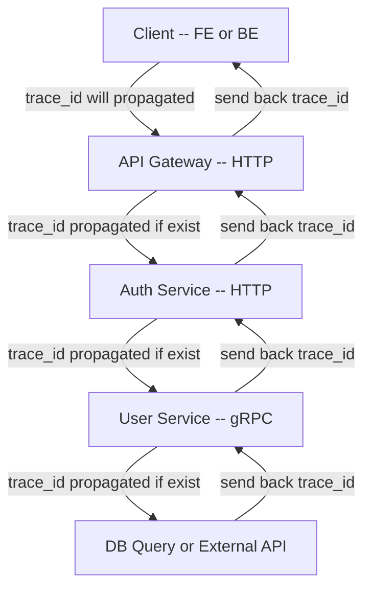
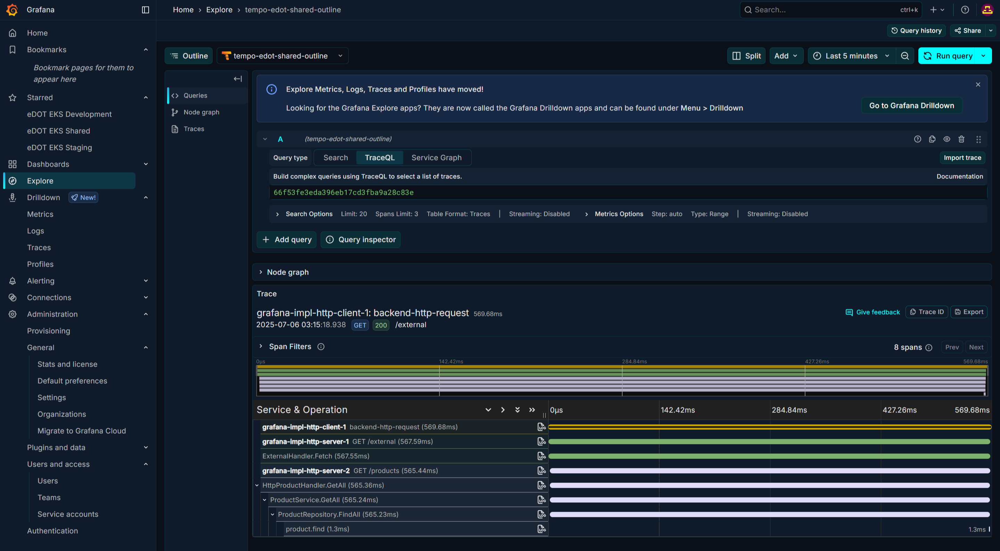

# Logging Standards (OTel-Compatible)

# Overview

This document outlines the **standard logging format** for services using [OpenTelemetry semantic conventions](https://opentelemetry.io/docs/specs/semconv/). All logs are expected to be in **flattened JSON format**, and structured in a way that enables seamless correlation with trace and metric data. No nested JSON objects are allowed.

> ⚠️ **Important Notes:**
>
> * All fields must be **flat JSON keys** (e.g. `a.b.c`, not nested objects)
> * Avoid large binary payloads
> * Sensitive data should be masked or excluded
> * Use structured log format (JSON) for maximum compatibility

Each field is marked as ***__optional__*** can be omitted depending on context, __else it's should be mandatory__.


---

# End-to-End Tracing

This standard is designed to ensure **complete end-to-end traceability** across distributed systems.

By enforcing propagation of `trace_id` and `span_id` throughout all services, we can:

* Track user activity across multiple microservices
* Understand latency and bottlenecks between services
* Pinpoint failure sources during errors
* Visualize request journeys in Grafana Tempo

> ⚠️ **IMPORTANT:** You **must propagate the trace context** (trace ID, span ID, baggage, etc.) through every handler, worker, or process that touches the request lifecycle.


## 🔁 Trace Flow Diagram

Follow this official standards [https://www.w3.org/TR/trace-context](https://www.w3.org/TR/trace-context/)
> If Otel Propagation lib are not available on your code stack, please use standard
>
> * Headers fields `X-TRACE-ID` on HTTP/WebSocket
> * Trailers fields `X-TRACE-ID` on gRPC



 

## 🧠 Key Concepts

* **Every hop must carry the trace context**.
* `trace_id` stays the same throughout a request.
* `span_id` changes per handler/function for granularity.
* If trace context is lost in the middle (e.g. goroutine, channel, queue), the trace will breaks on Grafana.

## 🧩 Benefit Recap

| Benefit | Impact |
|----|----|
| Unified observability | Easier to debug and trace system behavior |
| Accurate latency mapping | Find which service/function causes bottleneck |
| Error correlation | Stacktrace and logs link to one trace |
| Service accountability | Each service/span is identifiable and traceable |


Continue reading below for full schema and logging formats.


---

# Proposed Log Format

## ✅ General

Fields:

* `timestamp` (String): ISO 8601 timestamp in RFC3339 format.
* `level` (String): Severity level of the log.
* `message` (String): A human-readable log message.

```json
{
  "timestamp": "2025-07-06T12:34:56.789Z",
  "level": "info",
  "message": "User successfully logged in"
}
```

**Allowed** `**level**` **values:** `debug`, `info`, `warn`, `error`, `fatal`


---

## 🔗 Tracing

Fields:

* `trace_id` (String): Trace identifier from active context.
* `span_id` (String): Span identifier from the current operation.

```json
{
  "trace_id": "abc123...",
  "span_id": "def456..."
}
```


---

## 🧹 Service Metadata

> Automatically derived from internal repository metadata

Fields:

* `service.name` (String): Logical name of the service.
* `service.version` (String): Semantic version or build version.
* `service.git_revision` (String): Git SHA or commit identifier.

```json
{
  "service.name": "auth-service",
  "service.version": "1.4.2",
  "service.git_revision": "a1b2c3d4"
}
```


---

## 💥 Resource Metadata

> Derived from runtime/deployment environment

Fields:

* `resource.namespace` (String): Logical environment grouping (e.g. platform, analytics).
* `resource.hostname` (String): Host or pod name.

```json
{
  "resource.namespace": "user-platform",
  "resource.hostname": "pod-auth-1"
}
```


---

## 🔐 Authentication (optional)

> Only applicable if the user is authenticated

Fields:

* `auth.sub` (String): Subject or user identifier.
* `auth.client_id` (String): OAuth2 or application client ID.

```json
{
  "auth.sub": "user-1234",
  "auth.client_id": "web-client-abc"
}
```


---

## 🧠 Code Context (optional)

> [OpenTelemetry Code Semantics](https://opentelemetry.io/docs/specs/semconv/code/)

Fields:

* `code.function.name` (String): Function or method name.
* `code.file.path` (String): File path where the code is located.
* `code.line.number` (Number): Line number in the source code.

```json
{
  "code.function.name": "handleLogin",
  "code.file.path": "/src/auth/controller.go",
  "code.line.number": 128
}
```


---

## 🚨 Exception (optional)

> [OpenTelemetry Exception Conventions](https://opentelemetry.io/docs/specs/semconv/exceptions/exceptions-logs/)

Fields:

* `exception.message` (String): Message from the thrown error.
* `exception.type` (String): Class or category of the exception.
* `exception.stacktrace` (String): Full stack trace as string.

```json
{
  "exception.message": "failed to connect to DB",
  "exception.type": "DBConnectionError",
  "exception.stacktrace": "..."
}
```


---

## 🌐 HTTP (optional)

> Used for HTTP request/response, client or server

Fields:

* `http.direction` (String): `incoming` or `outgoing`
* `http.remote_addr` (String): IP address of the client/server
* `http.method` (String): HTTP verb (GET, POST, etc.)
* `http.path` (String): Path of the request
* `http.query.$key` (String): Query parameters
* `http.headers.$key` (Any): HTTP header values
* `http.payload.$key` (Any): Payload fields
* `http.status` (String): HTTP status code as string
* `http.duration` (String): Duration string (e.g. "120ms")

```json
{
  "http.direction": "incoming",
  "http.remote_addr": "192.168.1.10",
  "http.method": "POST",
  "http.path": "/api/login",
  "http.query.user": "john",
  "http.headers.content_type": "application/json",
  "http.payload.username": "john",
  "http.payload.remember": true,
  "http.status": "200",
  "http.duration": "125ms"
}
```


---

## 📱 gRPC (optional)

> Used for gRPC request/response, client or server

Fields:

* `grpc.direction` (String): `incoming` or `outgoing`
* `grpc.remote_addr` (String): Target address
* `grpc.method` (String): Full gRPC method signature
* `grpc.trailers.$key` (Any): Response metadata (trailers)
* > keep in mind trailers just like http headers
* `grpc.payload.$key` (Any): Payload fields
* `grpc.status` (String): Status (OK, UNAVAILABLE, etc.)
* `grpc.duration` (String): Execution time (e.g. "80ms")

```json
{
  "grpc.direction": "outgoing",
  "grpc.remote_addr": "10.0.0.5:50051",
  "grpc.method": "AuthService.Login",
  "grpc.payload.username": "john",
  "grpc.payload.password": "*****",
  "grpc.trailers.content_type": "application/grpc",
  "grpc.status": "OK",
  "grpc.duration": "80ms"
}
```


---

## 📡 WebSocket (optional)

> Used for WebSocket messaging

Fields:

* `websocket.direction` (String): `incoming` or `outgoing`
* `websocket.remote_addr` (String): Client IP
* `websocket.method` (String): Logical operation/event
* `websocket.path` (String): WS endpoint path
* `websocket.query.$key` (String): URL parameters
* `websocket.headers.$key` (Any): Headers from handshake
* `websocket.payload.$key` (Any): Actual WS message
* `websocket.status` (String): `ok`, `error`, `closed`, etc.
* `websocket.duration` (String): Response time

```json
{
  "websocket.direction": "incoming",
  "websocket.remote_addr": "10.0.0.12",
  "websocket.method": "sendMessage",
  "websocket.path": "/ws/chat",
  "websocket.query.room": "general",
  "websocket.headers.authorization": "Bearer ***",
  "websocket.payload.text": "Hello world",
  "websocket.status": "ok",
  "websocket.duration": "20ms"
}
```


---

## 🚗 Queue (optional)

> Used for Kafka, RabbitMQ, SQS, PubSub, etc.

Fields:

* `queue.direction` (String): `produce` or `consume`
* `queue.protocol` (String): kafka, rabbitmq, sqs, etc.
* `queue.topic` (String): Topic or queue name
* `queue.partition` (Number): Partition ID (if applicable)
* `queue.offset` (Number): Message offset
* `queue.headers.$key` (Any): Optional metadata
* `queue.payload.$key` (Any): Message content
* `queue.status` (String): `ack`, `nack`, `retry`
* `queue.duration` (String): Processing time

```json
{
  "queue.direction": "consume",
  "queue.protocol": "kafka",
  "queue.topic": "user-events",
  "queue.partition": 4,
  "queue.offset": 128393,
  "queue.headers.message_type": "user.created",
  "queue.payload.user_id": "1234",
  "queue.status": "ack",
  "queue.duration": "67ms"
}
```


---

## :mango: MongoDB (optional)

> Used for MongoDB.

Fields:

* `db.system.name` (String): `mongodb`
* `db.collection.name` (String): MongoDB Collection Name
* `db.namespace` (String): MongoDB Database Name
* `db.operation.name` (String): The name of MongoDB Command
* `db.response.status_code` (String): [MongoDB Status Code](https://www.mongodb.com/docs/manual/reference/error-codes/)
* `db.client.operation.duration` (String): Processing time

```javascript
{
  "db.system.name": "mongodb",
  "db.collection.name": "users",
  "db.namespace": "edot",
  "db.operation.name": "find",
  "db.response.status_code": "0",
  "db.client.operation.duration": "12ms"
}
```


---

## :red_circle: Redis (optional)

> Used for Redis.

Fields:

* `db.system.name` (String): `redis`
* `db.namespace` (String): Redis DB Index
* `db.operation.name` (String): The redis command name
* `db.response.status_code` (String): [Redis Status Code](https://redis.io/docs/latest/develop/reference/protocol-spec/#simple-errors)
* `db.client.operation.duration` (String): Processing time

```javascript
{
  "db.system.name": "redis",
  "db.namespace": "0",
  "db.operation.name": "HMSET",
  "db.response.status_code": "OK",
  "db.client.operation.duration": "5ms"
}
```


---

## 🛠️ Custom Data (optional)

> For flexible debug/operational context

Fields:

* `data.$key` (Any): Arbitrary debug info

```json
{
  "data.user_id": "1234",
  "data.plan_type": "enterprise",
  "data.experiment_variant": "B",
  "data.debug_note": "Used to trace experiment logic behavior",
  "data.internal_flag": true
}
```


---

# Notes

This logging standard ensures high observability, traceability, and full interoperability with OpenTelemetry, Grafana Tempo, and Loki. Teams are encouraged to adopt this format consistently across services to enable:

* Unified log correlation and trace linking
* Effective error investigation and SLO tracking
* Long-term maintainability of telemetry pipelines


As services evolve, this standard may be extended. Always follow semantic conventions, keep logs clean and lean, and document your custom keys.


Happy logging! 🚀